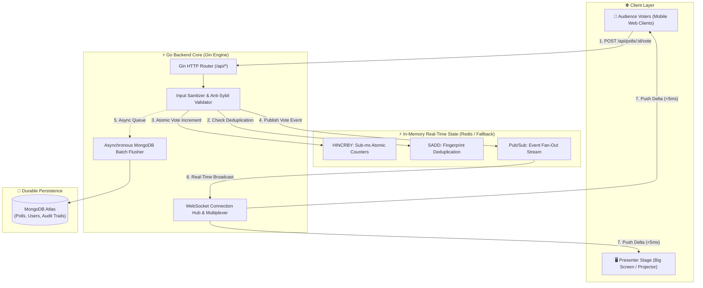

<div align="center">

# ⚡ SyncPoll
### High-Performance Real-Time Audience Polling & Spatial Consensus Platform

[](https://go.dev)
[](https://react.dev)
[](https://vitejs.dev)
[](https://redis.io)
[](https://mongodb.com)
[](https://developer.mozilla.org/en-US/docs/Web/API/WebSockets_API)
[](LICENSE)

<br />

<p align="center">
  <b>Ultra-low-latency, zero-refresh audience decision platform engineered for live conferences, hybrid auditoriums, and interactive university keynote lectures.</b>
</p>

[Explore Live Demo](https://occupation-questionnaire-transcript-factor.trycloudflare.com) • [Report Issue](https://github.com/mrkugan54/SYNCPOLL/issues) • [GitHub Repository](https://github.com/mrkugan54/SYNCPOLL)

</div>

---

> ### 🎓 Project Architect & Academic Attribution
> - **Lead Architect & Developer**: **MR. KUGAN**
> - **Academic Degree**: **Master of Computer Applications (MCA)**
> - **Institution**: **SRM Institute of Science and Technology**, Kattankulathur, Chennai, Tamil Nadu, India
> - **Project Repository**: [https://github.com/mrkugan54/SYNCPOLL](https://github.com/mrkugan54/SYNCPOLL)

---

## 🌟 Standout Polling Formats

<table>
  <tr>
    <td width="50%">
      <h3>📊 Live Interactive Choice Polls</h3>
      <p>Single & multi-option voting with sub-millisecond animated progress meters, dynamic color gradients, leader highlights, and live attendee tallies.</p>
      <ul>
        <li>Real-time percentage recalculations</li>
        <li>Instant winner and leader attribution</li>
        <li>High-contrast visual hierarchy</li>
      </ul>
    </td>
    <td width="50%">
      <h3>⚔️ Tug-of-War Clash Battles</h3>
      <p>High-voltage 1-on-1 clash debates (e.g. <i>React vs Vue</i> or <i>Go vs Rust</i>) featuring a physical vector tug-of-war diagram shifting dynamically in real time.</p>
      <ul>
        <li>Real-time momentum indicator</li>
        <li>Dynamic vector physics visualization</li>
        <li>Split team crowd engagement</li>
      </ul>
    </td>
  </tr>
  <tr>
    <td width="50%">
      <h3>🛡️ Unbiased Voter Experience</h3>
      <p>Clean double-blind voting flow. Voters focus purely on the choices without exposure to early trend bias until their own ballot is cast.</p>
      <ul>
        <li>Blind ballot interface pre-vote</li>
        <li>Instant <code>✓ Your Choice</code> verification badge</li>
        <li>Live score & percentage reveal post-vote</li>
      </ul>
    </td>
    <td width="50%">
      <h3>👤 Real Audience Attribution Feed</h3>
      <p>Transparent live participant activity feed showing genuine attendees as they cast votes with zero fabricated accounts.</p>
      <ul>
        <li>Reverse-chronological voter feed</li>
        <li>Verified name badge attribution</li>
        <li>Device cryptographic deduplication</li>
      </ul>
    </td>
  </tr>
</table>

---

## 🏗️ System Architecture & Data Pipeline



---

## 📁 Repository Directory Structure

```text
SYNCPOLL/
├── backend/
│   ├── cmd/
│   │   └── server/          # Go HTTP & WebSocket entrypoint
│   ├── internal/
│   │   ├── config/          # Environment configuration
│   │   ├── database/        # MongoDB & In-Memory fallback store
│   │   ├── handlers/        # Gin REST controllers & WebSocket hub
│   │   ├── middleware/      # JWT auth, CORS & security headers
│   │   ├── models/          # Typed data schemas
│   │   ├── services/        # Real-time state & tally calculation
│   │   └── websocket/       # Connection pooling & event routing
│   ├── pkg/                 # Crypto, JWT & fingerprinting utilities
│   ├── .env.example
│   ├── Dockerfile
│   ├── go.mod
│   └── go.sum
├── frontend/
│   ├── public/              # Brand SVG assets & favicon
│   ├── src/
│   │   ├── api/             # HTTP API client
│   │   ├── components/      # ChoiceViewer, ClashViewer, Footer, Navbar
│   │   ├── context/         # Auth & Theme (Light/Dark) providers
│   │   ├── hooks/           # WebSocket real-time subscription hook
│   │   ├── pages/           # HomePage, CreatePoll, Dashboard, Voter, Presenter
│   │   ├── utils/           # Canvas device fingerprinting
│   │   ├── App.jsx
│   │   └── index.css        # Clean glassmorphism design tokens
│   ├── package.json
│   ├── vite.config.js
│   ├── Dockerfile
│   └── README.md
├── docker-compose.yml
├── run-all.bat              # One-click Windows runner
├── run-backend.bat          # Standalone backend launcher
├── run-frontend.bat         # Standalone Vite launcher
├── run-tunnel.bat           # Cloudflare HTTPS tunnel runner
├── .gitignore
└── README.md
```

---

## 💡 Meaningful Stack Architecture

| Technology | Role | Concrete Engineering Implementation |
| :--- | :--- | :--- |
| **Go 1.22 (Gin)** | Backend & WebSocket Core | Employs lightweight Goroutines and non-blocking channels to manage thousands of concurrent persistent client sockets without memory bloating. |
| **Redis 7** | Atomic Engine & Pub/Sub | Uses atomic `HINCRBY` to guarantee zero lock contention during simultaneous audience voting spikes, backed by `SADD` anti-sybil fingerprinting. |
| **MongoDB Atlas** | Long-Term Durable Store | Stores cryptographically hashed user credentials, structured multi-format poll metadata, and immutable vote audit logs. |
| **React 19 + Vite** | Reactive Frontend Interface | Fast client rendering, zero-dependency SVG vector physics, custom dark/light theme tokens, and auto-reconnecting WebSocket state machines. |

---

## 🛡️ Anti-Fraud & Cryptographic Security

SyncPoll eliminates ballot stuffing without requiring audience members to complete cumbersome sign-up flows:

1. **Hardware Canvas Fingerprinting**: Combines browser GPU renderer signature, color depth, system font vector metrics, and timezone into a client fingerprint.
2. **Double-Blind Redis Barrier**: When a ballot is submitted, Redis executes `SADD poll:<id>:voters <sha256_hash>`. If the fingerprint already exists, the vote is instantly rejected with `409 Conflict`.
3. **Strict Go Bound Validation**: Option IDs, title constraints, and payload lengths are enforced in typed Go structs prior to touching memory stores.

---

## 🚀 Quick Start & Installation

### Option 1: Docker Compose (Fastest)
Clone the repository and spin up all services with one command:
```bash
git clone https://github.com/mrkugan54/SYNCPOLL.git
cd SYNCPOLL
docker compose up --build
```
- **Web App**: `http://localhost:3000`
- **Backend API**: `http://localhost:8080`
- **MongoDB**: `localhost:27017`
- **Redis**: `localhost:6379`

---

### Option 2: Native Development Setup

#### 1. Backend (Go)
```bash
cd backend
cp .env.example .env
go mod download
go run cmd/server/main.go
```
*The Go server starts on `http://localhost:8080` (gracefully enables high-performance in-memory fallback if local Redis/Mongo are absent).*

#### 2. Frontend (React + Vite)
```bash
cd frontend
npm install
npm run dev
```
*Access the frontend at `https://localhost:5173`.*

---

## ⚙️ Environment Variables

The backend uses the following environment variables (defined in `backend/.env.example`):

| Variable | Default / Example | Purpose |
| :--- | :--- | :--- |
| `PORT` | `8080` | HTTP and WebSocket port |
| `MONGO_URI` | `mongodb://localhost:27017` | MongoDB connection string |
| `MONGO_DB_NAME` | `syncpoll` | Target database name |
| `REDIS_URI` | `redis://localhost:6379` | Redis instance URL |
| `JWT_SECRET` | `your-secret-key-32-chars` | HMAC-SHA256 signing secret |
| `CORS_ORIGIN` | `http://localhost:5173` | Allowed CORS origins |

---

## 📜 REST & WebSocket API Specification

### Authentication & Profiles
| Method | Endpoint | Description | Auth Required |
| :--- | :--- | :--- | :---: |
| `POST` | `/api/auth/register` | Register new presenter/creator account | No |
| `POST` | `/api/auth/login` | Authenticate creator and retrieve JWT | No |
| `GET` | `/api/auth/me` | Retrieve profile of authenticated user | Yes |

### Polls & Sessions
| Method | Endpoint | Description | Auth Required |
| :--- | :--- | :--- | :---: |
| `POST` | `/api/polls` | Create new Choice or Clash session | Yes |
| `GET` | `/api/polls` | List all polls created by current user | Yes |
| `GET` | `/api/polls/:idOrCode` | Get poll config, options, and live tallies | No |
| `PATCH` | `/api/polls/:id/status` | Pause/resume voting or toggle results | Yes |
| `DELETE` | `/api/polls/:id` | Delete poll and purge associated state | Yes |

### Voting & Real-Time Stream
| Protocol | Endpoint | Description |
| :--- | :--- | :--- |
| `POST` | `/api/polls/:id/vote` | Submit ballot with device fingerprint & voter name |
| `POST` | `/api/polls/:id/react` | Stream floating reaction emojis (🔥, 👏, 💡, 🚀) |
| `WS` | `/ws/polls/:id` | Real-time duplex WebSocket stream for instant updates |

---

## 👨‍💻 Author & Academic Credits

<div align="center">

### **MR. KUGAN**
**Master of Computer Applications (MCA)**  
**SRM Institute of Science and Technology**, Kattankulathur, Chennai, India

[](https://github.com/mrkugan54)
[](https://github.com/mrkugan54/SYNCPOLL)

*Crafted with passion for real-time systems, distributed state synchronization, and high-concurrency human-computer consensus interfaces.*

</div>

---

## 📄 License
This project is open-source software licensed under the **MIT License**. Feel free to use, enhance, and extend it for academic and commercial use cases.
