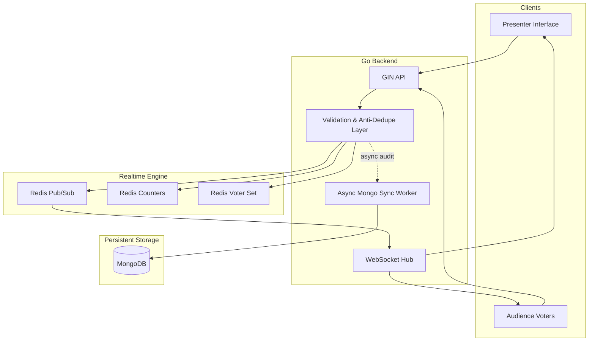

# SyncPoll

<p align="center">
  
  
  
  
  
</p>

<p align="center">
  <strong>Real-time polling for live events, classrooms, and high-energy presentations.</strong>
</p>

SyncPoll is a modern audience engagement platform engineered for instant interaction at scale. Presenters can launch live polls in seconds, while attendees vote from their phones and watch results update in real time. Built for fast feedback loops, live decision-making, and highly interactive sessions, SyncPoll blends real-time infrastructure with a polished experience.

## Built for live momentum

- Instant audience feedback
- Live polling with real-time result updates
- Multi-format engagement experiences
- High-concurrency vote handling
- Anti-duplicate protection and secure backend validation
- Clean presenter + audience experiences in one platform

## Product highlights

### Live polling modes

- Choice polls with live result bars
- Multi-select voting
- Tug-of-war style comparison polling
- Emoji reaction streams
- Real-time audience energy and sentiment tracking

### Engineering advantages

- Redis-powered atomic vote counting
- Pub/Sub event broadcasting across clients
- WebSocket-driven live synchronization
- MongoDB persistence for accounts, polls, and audit records
- Graceful fallback mode for local testing and demos

### Security and trust

- JWT-based creator authentication
- Server-side validation before writes
- duplicate-vote rejection using hashed device fingerprints
- protected input sanitization and option validation

## System architecture



## Tech stack

| Layer | Technology | Purpose |
| --- | --- | --- |
| Backend | Go + Gin | API layer, auth, websocket hub, concurrency management |
| Realtime | Redis | atomic vote counting, deduplication, pub/sub fan-out |
| Database | MongoDB | users, poll state, audit logs |
| Frontend | React + Vite | interactive presenter and audience interfaces |
| Local environment | Docker Compose | rapid bootstrapping for development and demos |

## Quick start

### Option 1: Docker Compose

```bash
docker-compose up --build
```

Open the app in your browser:

- Frontend: http://localhost:3000
- Backend API: http://localhost:8080
- MongoDB: localhost:27017
- Redis: localhost:6379

### Option 2: Manual setup

#### Backend

```bash
cd backend
cp .env.example .env
go run cmd/server/main.go
```

#### Frontend

```bash
cd frontend
npm install
npm run dev
```

Open:

- Frontend: http://localhost:5173
- Backend: http://localhost:8080

## Repository structure

```text
.
├── backend/
│   ├── cmd/
│   ├── internal/
│   ├── .env.example
│   └── go.mod
├── frontend/
│   ├── src/
│   ├── package.json
│   └── vite.config.*
├── docker-compose.yml
├── run-all.bat
├── run-backend.bat
├── run-frontend.bat
├── run-tunnel.bat
├── README.md
├── .gitignore
└── LICENSE
```

## Deployment-ready setup

SyncPoll is designed to be easy to deploy across a modern cloud stack:

- MongoDB Atlas for durable storage
- Upstash Redis for the realtime layer
- Render, Railway, or Fly.io for the Go backend
- Vercel or Netlify for the frontend

Example environment variables:

```bash
MONGO_URI=your_mongodb_uri
REDIS_URI=your_redis_uri
JWT_SECRET=your_secure_secret
PORT=8080
```

Frontend config:

```bash
VITE_API_URL=https://your-backend-url/api
VITE_WS_URL=wss://your-backend-url
```

## API surface

### Authentication

- `POST /api/auth/register`
- `POST /api/auth/login`
- `GET /api/auth/me`

### Poll management

- `POST /api/polls`
- `GET /api/polls`
- `GET /api/polls/:id`
- `PATCH /api/polls/:id/status`
- `DELETE /api/polls/:id`

### Interaction endpoints

- `POST /api/polls/:id/vote`
- `POST /api/polls/:id/react`
- `GET /ws/polls/:id`

## Why this project stands out

SyncPoll addresses a real problem in live audience experiences: handling a burst of simultaneous voting without sacrificing speed, correctness, or trust. Instead of writing directly to the database on every vote, it uses Redis for atomic counting, deduplication, and broadcast propagation. That gives presenters a responsive, polished experience even during high-pressure events.

## Contributing

We welcome contributions that improve the platform, expand poll types, refine the UX, or strengthen performance and security.

## License

This project is intended for personal, educational, or portfolio use unless a repository license states otherwise.

<p align="center">
  <sub>Built for live events, classrooms, and real-time decision making.</sub>
</p>
