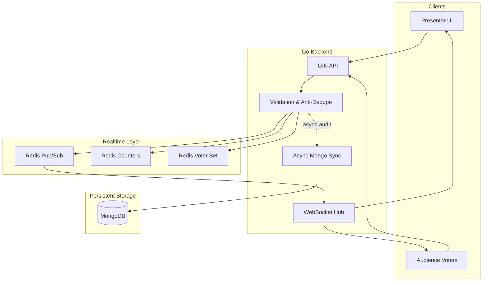

# SyncPoll

<p align="center">
  
  
  
  
  
</p>

<p align="center">
  <strong>Real-time audience polling, live voting, and spatial decision-making for events, classrooms, and presentations.</strong>
</p>

SyncPoll is a full-stack real-time polling platform that turns live audiences into interactive participants. Presenters can launch polls instantly, while attendees vote in real time from their devices. Results update instantly across the screen, with support for multiple poll formats, anti-duplicate protections, and a fast backend designed for high-concurrency traffic.

## Why SyncPoll?

- Live, real-time voting with instant updates
- Multiple engagement formats: choice polls, tug-of-war, emoji reactions
- Fast, scalable backend built in Go
- Redis-powered atomic vote counting and pub/sub broadcasts
- Secure creator auth and anti-fraud vote validation
- Frontend built with React for responsive, modern UX

## Core features

### Polling modes

- Choice polls with live winner tracking
- Multi-select voting
- Tug-of-war clash mode
- Real-time emoji reactions
- Live result bars and animated updates

### Performance and reliability

- Atomic vote counting with Redis `HINCRBY`
- Deduplication using Redis sets
- WebSocket broadcasting for live state sync
- MongoDB persistence for polls, accounts, and audit logs
- Graceful in-memory fallback for local testing

### Security

- JWT-based creator authentication
- Server-side validation before data writes
- Duplicate-vote prevention via hashed device fingerprinting
- Protected input sanitization and option checking

## Architecture overview



## Tech stack

| Layer | Technology | Purpose |
| --- | --- | --- |
| Backend | Go + Gin | API, auth, websocket hub, concurrency handling |
| Cache / Realtime | Redis | Atomic counters, dedupe checks, event fan-out |
| Database | MongoDB | Poll metadata, user accounts, audit logs |
| Frontend | React + Vite | Interactive UI and live presentation screens |
| Dev Ops | Docker Compose | Fast local environment startup |

## Quick start

### Option 1: Docker Compose

Make sure Docker is running, then:

```bash
docker-compose up --build
```

After startup:

- Frontend: http://localhost:3000
- Backend API: http://localhost:8080
- MongoDB: localhost:27017
- Redis: localhost:6379

### Option 2: Manual local setup

#### Backend

```bash
cd backend
cp .env.example .env
go run cmd/server/main.go
```

#### Frontend

```bash
cd frontend
npm install
npm run dev
```

Open:

- Frontend: http://localhost:5173
- Backend: http://localhost:8080

## Project structure

```text
.
├── backend/
│   ├── cmd/
│   ├── internal/
│   ├── .env.example
│   └── go.mod
├── frontend/
│   ├── src/
│   ├── package.json
│   └── vite.config.*
├── docker-compose.yml
├── run-all.bat
├── run-backend.bat
├── run-frontend.bat
├── run-tunnel.bat
├── README.md
└── .gitignore
```

## Deployment

### Cloud-ready setup

- MongoDB Atlas for durable storage
- Upstash Redis for managed pub/sub and counters
- Render, Railway, or Fly.io for the Go API
- Vercel or Netlify for the frontend

Example backend environment variables:

```bash
MONGO_URI=your_mongodb_uri
REDIS_URI=your_redis_uri
JWT_SECRET=your_secure_secret
PORT=8080
```

Frontend environment values:

```bash
VITE_API_URL=https://your-backend-url/api
VITE_WS_URL=wss://your-backend-url
```

## API overview

### Auth

- `POST /api/auth/register`
- `POST /api/auth/login`
- `GET /api/auth/me`

### Polls

- `POST /api/polls`
- `GET /api/polls`
- `GET /api/polls/:id`
- `PATCH /api/polls/:id/status`
- `DELETE /api/polls/:id`

### Voting

- `POST /api/polls/:id/vote`
- `POST /api/polls/:id/react`
- `GET /ws/polls/:id`

## Why this project stands out

SyncPoll was designed to solve a real engineering challenge: handling live audience traffic without sacrificing correctness or speed. Instead of writing every vote directly to a database, it uses Redis for atomic increments, deduplication, and instant fan-out. This keeps the experience responsive even when many users vote at once.

## Contributing

Contributions are welcome. If you want to improve the poll engine, add new voting modes, optimize the UI, or harden security, feel free to open a pull request.

## License

This project is currently intended for personal or educational use as part of a live demo / portfolio project. Please check the repository for the applicable licensing terms if you plan to reuse the code.

<p align="center">
  <sub>Built for live events, classrooms, and interactive presentations.</sub>
</p>
